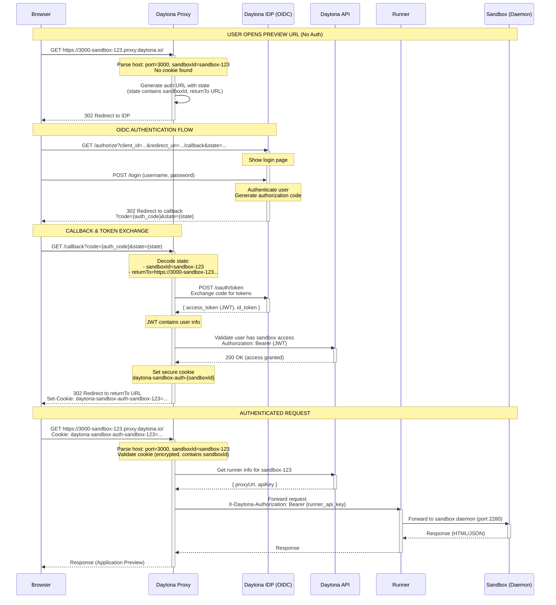
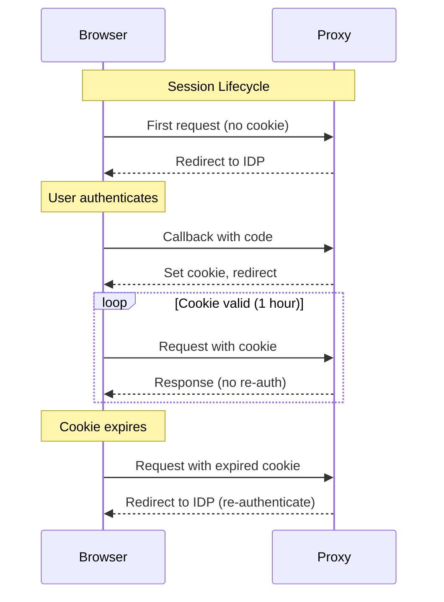
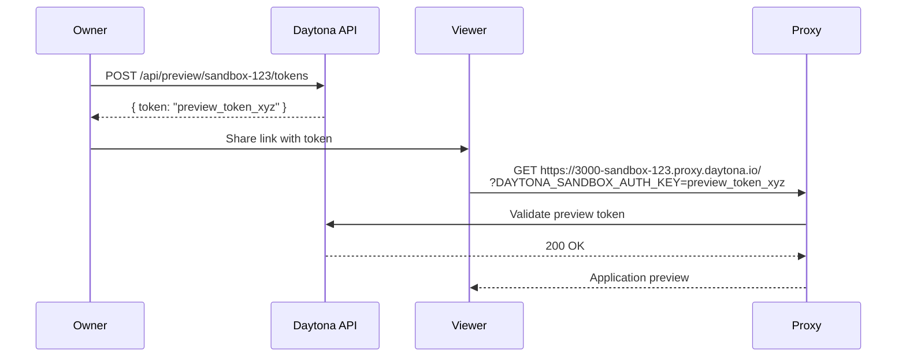

# Browser Preview Authentication Flow Sequence Diagram

This diagram illustrates how browser-based application preview works with Daytona IDP using OIDC/JWT authentication.

## Browser Application Preview (OIDC Authentication)



## Key Flow Points

### 1. Authentication Flow Overview

**User Journey:**
1. User opens preview URL in browser (e.g., `https://3000-sandbox-123.proxy.daytona.io`)
2. No authentication → Redirected to Daytona IDP login
3. User logs in with credentials
4. IDP redirects back with authorization code
5. Proxy exchanges code for JWT access token
6. Proxy validates user has sandbox access
7. Proxy sets secure cookie
8. User redirected to original preview URL
9. Subsequent requests use cookie (no re-authentication)

### 2. OIDC State Parameter

**State Structure:**
```json
{
  "state": "random_nonce_for_csrf_protection",
  "returnTo": "https://3000-sandbox-123.proxy.daytona.io/dashboard",
  "sandboxId": "sandbox-123"
}
```

**Encoded State:**
```
Base64(JSON) → passed to IDP → returned in callback
```

**Purpose:**
- CSRF protection
- Store original URL to redirect after auth
- Track which sandbox is being accessed

### 3. Cookie-Based Session

**Cookie Name:**
```
daytona-sandbox-auth-{sandboxId}
```

**Cookie Properties:**
- **Value**: Encrypted with securecookie (contains sandboxId)
- **Domain**: `.proxy.daytona.io` (wildcard for all subdomains)
- **HttpOnly**: `true` (prevents JavaScript access)
- **Secure**: `true` (HTTPS only)
- **Max-Age**: 3600 seconds (1 hour)
- **Path**: `/`

**Cookie Validation:**
```go
// Decrypt cookie
var decodedValue string
err := secureCookie.Decode("daytona-sandbox-auth-sandbox-123", cookieValue, &decodedValue)

// Verify sandboxId matches
if decodedValue != "sandbox-123" {
    return errors.New("invalid cookie")
}
```

### 4. JWT Access Token

**Token Contents:**
```json
{
  "sub": "user-123",
  "email": "user@example.com",
  "iss": "https://auth.daytona.io",
  "aud": "daytona-api",
  "exp": 1699564800,
  "iat": 1699561200,
  "scope": "openid profile"
}
```

**Usage:**
- Validates user identity
- Checks sandbox access via Daytona API
- Not stored in cookie (only used during initial auth)

### 5. Authentication Methods Priority

The proxy checks authentication in this order:

1. **Bearer Token (API Key/JWT)** - For SDK/programmatic access
   ```
   Authorization: Bearer {api_key_or_jwt}
   ```

2. **Cookie** - For browser sessions
   ```
   Cookie: daytona-sandbox-auth-{sandboxId}={encrypted_value}
   ```

3. **Preview Token Header** - For shared links
   ```
   X-Daytona-Preview-Token: {preview_token}
   ```

4. **Query Parameter** - For one-time links
   ```
   ?DAYTONA_SANDBOX_AUTH_KEY={preview_token}
   ```

5. **No Auth** → Redirect to IDP login

### 6. Public vs Private Sandboxes

**Public Sandbox:**
- No authentication required for most ports
- Terminal (22222) and Toolbox (2280) always require auth
- API checks: `GET /api/preview/{sandboxId}/is-public`

**Private Sandbox:**
- All ports require authentication
- Enforced for all requests

### 7. OIDC Configuration

**Proxy OIDC Config:**
```yaml
oidc:
  domain: https://auth.daytona.io
  public_domain: https://auth.daytona.io  # External-facing domain
  client_id: daytona-proxy-client
  client_secret: ${OIDC_CLIENT_SECRET}
  audience: daytona-api
```

**OIDC Endpoints:**
```
Authorization: https://auth.daytona.io/authorize
Token:         https://auth.daytona.io/oauth/token
UserInfo:      https://auth.daytona.io/userinfo
JWKS:          https://auth.daytona.io/.well-known/jwks.json
```

## API Endpoints

### Daytona IDP (OIDC Provider)

```
GET  /authorize                              - Authorization endpoint (login redirect)
POST /oauth/token                            - Token exchange endpoint
GET  /userinfo                               - User info endpoint
GET  /.well-known/openid-configuration       - OIDC discovery
GET  /.well-known/jwks.json                  - JSON Web Key Set
```

### Daytona Proxy

```
GET  /callback                               - OIDC callback (receives auth code)
ANY  /*                                      - Proxy handler (wildcard for all preview URLs)
```

### Daytona API

```
GET  /api/preview/{sandboxId}/access         - Validate user has sandbox access (JWT)
GET  /api/preview/{sandboxId}/is-public      - Check if sandbox is public
GET  /api/runners/by-sandbox/{sandboxId}     - Get runner info
```

## Example Flow with Screenshots

### 1. User Opens Preview URL

```
Browser → https://3000-sandbox-123.proxy.daytona.io/
```

**Response:**
```
HTTP/1.1 302 Found
Location: https://auth.daytona.io/authorize?
  client_id=daytona-proxy-client&
  redirect_uri=https://3000-sandbox-123.proxy.daytona.io/callback&
  response_type=code&
  scope=openid+profile&
  state=eyJzdGF0ZSI6InJhbmRvbSIsInJldHVyblRvIjoiaHR0cHM6Ly8zMDAwLXNhbmRib3gtMTIzLnByb3h5LmRheXRvbmEuaW8vIiwic2FuZGJveElkIjoic2FuZGJveC0xMjMifQ==
```

### 2. User Logs In

```
Browser displays Daytona login page
User enters credentials and submits
```

### 3. IDP Redirects to Callback

```
Browser → https://3000-sandbox-123.proxy.daytona.io/callback?
  code=auth_code_xyz&
  state=eyJzdGF0ZSI6InJhbmRvbSIsInJldHVyblRvIjoiaHR0cHM6Ly8zMDAwLXNhbmRib3gtMTIzLnByb3h5LmRheXRvbmEuaW8vIiwic2FuZGJveElkIjoic2FuZGJveC0xMjMifQ==
```

### 4. Proxy Exchanges Code for Token

```
POST https://auth.daytona.io/oauth/token
Content-Type: application/x-www-form-urlencoded

grant_type=authorization_code&
code=auth_code_xyz&
redirect_uri=https://3000-sandbox-123.proxy.daytona.io/callback&
client_id=daytona-proxy-client&
client_secret=secret
```

**Response:**
```json
{
  "access_token": "eyJhbGciOiJSUzI1NiIsInR5cCI6IkpXVCJ9...",
  "token_type": "Bearer",
  "expires_in": 3600,
  "id_token": "eyJhbGciOiJSUzI1NiIsInR5cCI6IkpXVCJ9...",
  "scope": "openid profile"
}
```

### 5. Proxy Sets Cookie and Redirects

```
HTTP/1.1 302 Found
Location: https://3000-sandbox-123.proxy.daytona.io/
Set-Cookie: daytona-sandbox-auth-sandbox-123=encrypted_value;
  Domain=.proxy.daytona.io;
  Path=/;
  Max-Age=3600;
  HttpOnly;
  Secure;
  SameSite=Lax
```

### 6. Browser Makes Authenticated Request

```
GET https://3000-sandbox-123.proxy.daytona.io/
Cookie: daytona-sandbox-auth-sandbox-123=encrypted_value
```

**Response:**
```
HTTP/1.1 200 OK
Content-Type: text/html

<!DOCTYPE html>
<html>
  <body>
    <!-- Application Preview Content -->
  </body>
</html>
```

## Security Considerations

### 1. CSRF Protection

- State parameter includes random nonce
- Validated in callback to prevent CSRF attacks
- State is base64-encoded JSON with original request data

### 2. Cookie Security

- **HttpOnly**: Prevents XSS attacks (JavaScript cannot read)
- **Secure**: Only sent over HTTPS
- **SameSite**: Prevents CSRF (browser doesn't send on cross-site requests)
- **Encrypted**: Cookie value encrypted with securecookie
- **Domain-scoped**: Only sent to `*.proxy.daytona.io`

### 3. JWT Validation

- JWT signature verified against JWKS
- Expiration checked
- Issuer and audience validated
- Used only for initial authorization (not stored)

### 4. Session Management

- Cookie expires after 1 hour (configurable)
- User must re-authenticate after expiration
- Cookie tied to specific sandbox (cannot access other sandboxes)

### 5. Network Security

- All communication over HTTPS
- TLS certificate validation
- Secure cookie transmission

## Browser Session Flow



## Configuration Examples

### Proxy Configuration

```yaml
# Daytona Proxy configuration
proxy:
  domain: proxy.daytona.io
  port: 443
  protocol: https
  enable_tls: true

daytona_api:
  url: https://api.daytona.io

oidc:
  domain: https://auth.daytona.io
  public_domain: https://auth.daytona.io
  client_id: daytona-proxy-client
  client_secret: ${OIDC_CLIENT_SECRET}
  audience: daytona-api

cookie:
  secure: true
  domain: .proxy.daytona.io
  max_age: 3600  # 1 hour
```

### Environment Variables

```bash
PROXY_DOMAIN=proxy.daytona.io
PROXY_PORT=443
PROXY_PROTOCOL=https
DAYTONA_API_URL=https://api.daytona.io
PROXY_API_KEY=proxy_key_xyz

# OIDC Configuration
OIDC_DOMAIN=https://auth.daytona.io
OIDC_CLIENT_ID=daytona-proxy-client
OIDC_CLIENT_SECRET=secret_xyz
OIDC_AUDIENCE=daytona-api
```

## Troubleshooting

### Issue: Redirect Loop

**Symptom:** Browser keeps redirecting between proxy and IDP

**Causes:**
- Cookie not being set (check domain, secure flag)
- Cookie being rejected by browser (SameSite policy)
- State parameter mismatch

**Solution:**
```bash
# Check cookie in browser DevTools → Application → Cookies
# Verify domain is .proxy.daytona.io (with leading dot)
# Ensure HTTPS is used (cookie has Secure flag)
```

### Issue: 401 Unauthorized After Login

**Symptom:** User logs in but gets 401 on callback

**Causes:**
- JWT validation fails (user doesn't have sandbox access)
- Token exchange failed
- API unreachable

**Solution:**
```bash
# Check proxy logs for token exchange errors
# Verify user has sandbox access: GET /api/preview/{sandboxId}/access
# Check OIDC configuration (client_id, client_secret)
```

### Issue: Cookie Not Sent

**Symptom:** Cookie exists but not sent with requests

**Causes:**
- Domain mismatch (cookie for different domain)
- SameSite policy blocking
- HTTPS required but using HTTP

**Solution:**
```bash
# Cookie domain must match request domain
# Use .proxy.daytona.io for wildcard
# Ensure all requests use HTTPS
```

## Alternative: Preview Tokens (No Login)

For sharing previews without requiring login:



**Use Cases:**
- Share preview with non-Daytona users
- Public demos
- Embedded previews in external sites

## Architecture References

- Self-Hosted Auth: [SANDBOX_AUTH_SELF_HOSTED_SEQUENCE_DIAGRAM.md](SANDBOX_AUTH_SELF_HOSTED_SEQUENCE_DIAGRAM.md)
- Public Cloud Auth: [SANDBOX_AUTH_SEQUENCE_DIAGRAM.md](SANDBOX_AUTH_SEQUENCE_DIAGRAM.md)
- Runner Registration: [RUNNER_REGISTRATION_SEQUENCE_DIAGRAM.md](RUNNER_REGISTRATION_SEQUENCE_DIAGRAM.md)
- Proxy Auth Implementation: [apps/proxy/pkg/proxy/auth_callback.go](apps/proxy/pkg/proxy/auth_callback.go)
