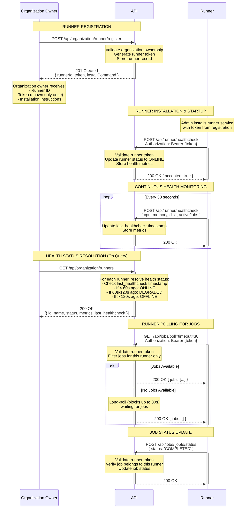

# Runner Registration Flow Sequence Diagram

This diagram illustrates the complete flow of runner registration, from organization owner initiating registration through runner installation, authentication, and health monitoring.

## Mermaid Sequence Diagram



## Key Flow Points

### 1. Runner Registration (One-Time Setup)

- Organization owner initiates registration via API
- API generates a unique runner token with scoped permissions:
  - `jobs:poll` - Poll for pending jobs
  - `jobs:update` - Update job status
  - `runner:healthcheck` - Send health metrics
- Token is returned **only once** during registration
- Runner record created with status `PENDING`
- Installation command provided with embedded token

### 2. Runner Token Security

**Token Properties:**

- Scoped to specific permissions (principle of least privilege)
- Cannot access organization data or user endpoints
- Cannot create/delete resources
- Only valid for the registered runner's organization
- Stored as hash in database (bcrypt/argon2)

**Token Validation on Each Request:**

```go
// Middleware validates:
1. Token signature valid
2. Token not expired/revoked
3. Required scope present
4. Runner belongs to resource's organization
```

### 3. Health-Based Status Resolution

The API determines runner status dynamically based on `last_healthcheck`:

| Last Healthcheck | Status | Description |
|-----------------|--------|-------------|
| < 60s ago | `ONLINE` | Runner actively sending heartbeats |
| 60s - 120s ago | `DEGRADED` | Missed 1-2 heartbeats, may be slow |
| > 120s ago | `OFFLINE` | No heartbeat for 3+ intervals |

**Implementation:**

```typescript
function calculateRunnerHealth(lastHealthcheck: Date): RunnerStatus {
  const secondsSinceLastCheck = (Date.now() - lastHealthcheck.getTime()) / 1000;

  if (secondsSinceLastCheck < 60) return 'ONLINE';
  if (secondsSinceLastCheck < 120) return 'DEGRADED';
  return 'OFFLINE';
}
```

### 4. Healthcheck Mechanism

**Runner Side (Every 30s):**

```go
ticker := time.NewTicker(30 * time.Second)
for range ticker.C {
    metrics := collectMetrics()
    sendHealthcheck(apiURL, token, metrics)
}
```

**API Side:**

- Updates `last_healthcheck` timestamp in DB
- Stores metrics in Redis with 90s TTL (3x interval)
- If Redis key expires, runner is considered unhealthy
- Database timestamp is source of truth

### 5. Organization Isolation

- Runners are scoped to organizations
- Token includes organization ID in claims
- Jobs filtered by runner's organization
- Prevents cross-organization job execution

## API Endpoints

### For Organization Owners (User Auth Required)

```
POST   /api/organization/runner/register          - Register new runner (returns token once)
GET    /api/organization/runners                  - List runners with health status
GET    /api/organization/runners/:id              - Get runner details
DELETE /api/organization/runners/:id              - Revoke runner (invalidates token)
POST   /api/organization/runners/:id/token/rotate - Rotate runner token
```

### For Runners (Runner Token Auth Required)

```
POST /api/runner/healthcheck                      - Send health metrics (every 30s)
GET  /api/jobs/poll?timeout=30&limit=10          - Long-poll for jobs (scoped to org)
POST /api/jobs/:jobId/status                      - Update job status (scoped to org)
```

## Database Schema

### Runner Table

```sql
CREATE TABLE runner (
  id VARCHAR PRIMARY KEY,
  name VARCHAR NOT NULL,
  "organizationId" VARCHAR NOT NULL REFERENCES organization(id),
  "tokenHash" VARCHAR NOT NULL,              -- bcrypt hash of token
  "tokenCreatedAt" TIMESTAMP NOT NULL,
  "tokenLastUsedAt" TIMESTAMP,
  status VARCHAR DEFAULT 'PENDING',          -- PENDING, ONLINE, DEGRADED, OFFLINE (computed)
  "lastHealthcheck" TIMESTAMP,
  version VARCHAR DEFAULT '3',
  metrics JSONB,                             -- { cpu, memory, disk, activeJobs }
  "createdAt" TIMESTAMP DEFAULT NOW(),
  "updatedAt" TIMESTAMP,

  CONSTRAINT unique_runner_per_org UNIQUE("organizationId", name)
);

CREATE INDEX idx_runner_org_health ON runner("organizationId", "lastHealthcheck");
CREATE INDEX idx_runner_token_hash ON runner("tokenHash");
```

### Runner Token (JWT Claims)

```json
{
  "sub": "runner-abc123",
  "type": "runner",
  "org": "org-xyz789",
  "scopes": ["jobs:poll", "jobs:update", "runner:healthcheck"],
  "iat": 1699564800,
  "exp": null  // Runner tokens don't expire (revoked manually)
}
```

## Registration Flow Example

### Step 1: Register Runner

```bash
curl -X POST http://localhost:3000/api/organization/runner/register \
  -H "Authorization: Bearer $ORG_OWNER_TOKEN" \
  -H "Content-Type: application/json" \
  -d '{
    "name": "production-runner-1",
    "organizationId": "org-123"
  }'
```

**Response:**

```json
{
  "runnerId": "runner-abc123",
  "token": "daytona_runner_xyz789...",
  "installCommand": "docker run -e RUNNER_TOKEN=daytona_runner_xyz789... daytonaio/runner:latest",
  "message": "Save this token securely - it will not be shown again"
}
```

### Step 2: Install Runner

```bash
# On runner server
export RUNNER_TOKEN="daytona_runner_xyz789..."
export API_URL="https://api.daytona.io"

docker run -d \
  --name daytona-runner \
  -e RUNNER_TOKEN=$RUNNER_TOKEN \
  -e API_URL=$API_URL \
  -v /var/run/docker.sock:/var/run/docker.sock \
  daytonaio/runner:latest
```

### Step 3: Verify Runner Online

```bash
curl http://localhost:3000/api/organization/runners \
  -H "Authorization: Bearer $ORG_OWNER_TOKEN"
```

**Response:**

```json
{
  "runners": [
    {
      "id": "runner-abc123",
      "name": "production-runner-1",
      "status": "ONLINE",
      "lastHealthcheck": "2024-01-15T10:30:45Z",
      "metrics": {
        "cpu": 45.2,
        "memory": 62.1,
        "disk": 78.5,
        "activeJobs": 3
      },
      "version": "3",
      "createdAt": "2024-01-15T09:00:00Z"
    }
  ]
}
```

## Token Management

### Rotating Runner Token

If a token is compromised, rotate it:

```bash
curl -X POST http://localhost:3000/api/organization/runners/:id/token/rotate \
  -H "Authorization: Bearer $ORG_OWNER_TOKEN"
```

**Response:**

```json
{
  "token": "daytona_runner_new_token...",
  "message": "Old token invalidated. Update runner configuration with new token."
}
```

### Revoking Runner

To completely remove a runner:

```bash
curl -X DELETE http://localhost:3000/api/organization/runners/:id \
  -H "Authorization: Bearer $ORG_OWNER_TOKEN"
```

- Invalidates token immediately
- Marks runner as `REVOKED`
- Any in-progress jobs continue (graceful shutdown)
- Future healthchecks/polls rejected with 401

## Security Considerations

### 1. Token Storage

- Never log tokens in plain text
- Store only bcrypt hash in database
- Token transmitted only over HTTPS
- Returned only once during registration

### 2. Scope Enforcement

```go
// Every runner endpoint checks:
func ValidateRunnerScope(requiredScope string) Middleware {
    return func(c *Context) {
        claims := c.Get("token_claims")
        if !contains(claims.Scopes, requiredScope) {
            return c.Status(403).JSON(Error{"insufficient_scope"})
        }
    }
}
```

### 3. Organization Isolation

```go
// Jobs filtered by organization:
func PollJobs(c *Context) {
    runnerOrgId := c.Get("runner").OrganizationId
    jobs := db.Query(
        "SELECT * FROM job WHERE org_id = $1 AND status = 'PENDING'",
        runnerOrgId,
    )
}
```

### 4. Rate Limiting

- Healthcheck: Max 1 req/10s per runner
- Job poll: Long-poll prevents spam
- Registration: Max 10 runners/hour per org

## Health Monitoring Architecture

### Why Redis + Database?

**Redis (Hot Storage):**

- Fast access to recent metrics
- TTL auto-expires stale data
- Powers real-time dashboards

**Database (Cold Storage):**

- `last_healthcheck` timestamp (source of truth)
- Historical health data
- Survives Redis restarts

### Health Resolution Logic

```typescript
async function getRunnerWithHealth(runnerId: string): Promise<RunnerWithHealth> {
  // 1. Get runner record from DB
  const runner = await db.runner.findUnique({ where: { id: runnerId } });

  // 2. Calculate status from last_healthcheck
  const status = calculateRunnerHealth(runner.lastHealthcheck);

  // 3. Get live metrics from Redis (if available)
  const metrics = await redis.get(`runner:${runnerId}:health`);

  return {
    ...runner,
    status,  // ONLINE/DEGRADED/OFFLINE
    metrics: metrics || runner.metrics,  // Live or last known
  };
}
```

## Testing the Registration Flow

### 1. Create Organization

```sql
INSERT INTO organization (id, name) VALUES ('org-test', 'Test Org');
INSERT INTO user_organization (user_id, organization_id, role)
VALUES ('user-123', 'org-test', 'OWNER');
```

### 2. Register Runner

```bash
./scripts/test-runner-registration.sh
```

### 3. Monitor Health Status

```bash
# Watch runner status in real-time
watch -n 1 'curl -s http://localhost:3000/api/organization/runners \
  -H "Authorization: Bearer $TOKEN" | jq ".runners[0].status"'
```

### 4. Simulate Offline

```bash
# Stop runner
docker stop daytona-runner

# Wait 120 seconds, then check status
# Should transition: ONLINE -> DEGRADED -> OFFLINE
```

## Architecture References

- Job Flow Diagram: [RUNNER_SERVICE_SEQUENCE_DIAGRAM.md](RUNNER_SERVICE_SEQUENCE_DIAGRAM.md)
- Runner Implementation: [apps/runner-service/](apps/runner-service/)
- API Runner Endpoints: [apps/api/src/routes/runner.ts](apps/api/src/routes/runner.ts)
