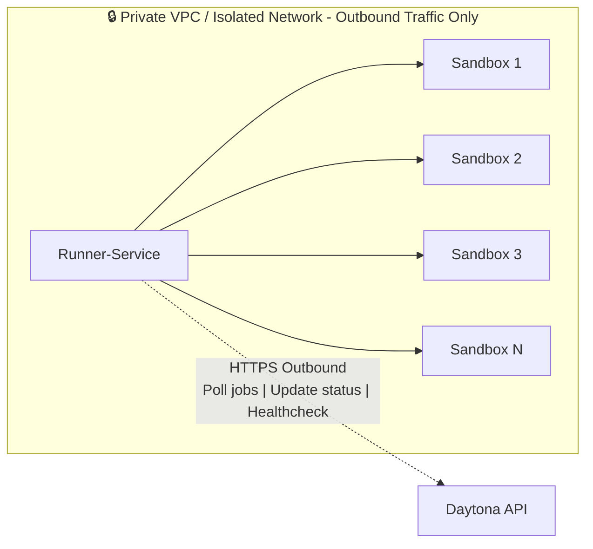

# Runner-Service Architecture Diagram

This diagram shows the high-level architecture of the runner-service and its communication patterns with Daytona API.

## Key Architectural Points

- **Outbound-only traffic**: Runner-service only makes outbound requests to Daytona API
- **No inbound ports**: Runner-service doesn't expose any HTTP endpoints
- **Pull-based model**: Runner pulls jobs from API via long-polling
- **Firewall-friendly**: Works behind NAT/firewalls since all connections are initiated by runner

## Architecture Diagram



## Communication Flow

### 1. Job Polling (Long-Poll)

```
Runner → API: GET /api/jobs/poll?timeout=30&limit=10
API → Runner: 200 OK { jobs: [...] }
```

- Runner initiates connection
- API blocks until jobs available or timeout
- Runner processes jobs locally

### 2. Job Status Updates

```
Runner → API: POST /api/jobs/:jobId/status { status: "COMPLETED" }
API → Runner: 200 OK
```

- Runner reports job progress and completion
- API updates job state in database

### 3. Health Reporting

```
Runner → API: POST /api/runner/healthcheck { metrics: {...} }
API → Runner: 200 OK
```

- Periodic health checks (every 30s)
- Reports CPU, memory, disk usage
- Updates runner's lastSeenAt timestamp

## Network Requirements

### Runner-Service (Outbound Only)

- **Required**: Outbound HTTPS to Daytona API
- **NOT Required**: No inbound ports needed
- **Firewall**: Works behind NAT/firewall/proxy

### Daytona API (Inbound Only)

- **Required**: Accept HTTPS from runners
- **NOT Required**: No outbound connections to runners

## Deployment Patterns

### Pattern 1: Runner in Private Network

```
[Internet] → [Daytona API (Public)]
                    ↑
                    | (outbound only)
[Private Network] → [Runner-Service]
                    ↓
                [Docker + Sandboxes]
```

### Pattern 2: Runner behind Corporate Firewall

```
[Cloud] → [Daytona API]
              ↑
              | (outbound HTTPS only)
[Corporate Firewall]
              |
          [Runner-Service]
              ↓
          [Docker + Sandboxes]
```

### Pattern 3: Multi-Region Runners

```
                [Daytona API (Central)]
                    ↑       ↑       ↑
        ┌───────────┼───────┼───────┼───────────┐
        |           |       |       |           |
    [Runner US] [Runner EU] [Runner APAC]
        |           |       |       |           |
    [Sandboxes] [Sandboxes] [Sandboxes]
```

## Security Model

### Authentication

- Runner authenticates with API using API key (Bearer token)
- API key stored securely on runner host
- No secrets stored in API for runner access

### Network Security

- All traffic over HTTPS (TLS 1.2+)
- No inbound ports on runner = reduced attack surface
- Runner can run in air-gapped environments (with API access)

### Isolation

- Each sandbox runs in isolated container
- Docker socket access restricted to runner process
- Runner manages sandbox lifecycle but cannot access sandbox internals

## Comparison: V0 vs V3 Architecture

### V0 (Legacy - Synchronous)

```
API → Runner: POST /runner/sandboxes/:id/start (inbound)
Runner → API: 200 OK (response)

Problem: Requires runner to expose HTTP endpoint
```

### V3 (Current - Job-Based)

```
Runner → API: GET /api/jobs/poll (outbound only)
API → Runner: 200 OK { jobs: [...] }

Benefit: No inbound ports on runner needed
```

## Scalability

### Horizontal Scaling

- Add more runner instances
- Each runner polls independently
- Load balancing handled by job queue

### Resource Isolation

- Each runner manages its own sandboxes
- No shared state between runners
- Runner failure doesn't affect others

### Auto-scaling

- Runners can be added/removed dynamically
- API tracks runner health via heartbeats
- Jobs automatically routed to available runners

## Configuration

### Runner Environment Variables

```bash
API_URL=https://api.daytona.io        # Daytona API endpoint
API_KEY=runner_xxxxxxxxxxxx           # Authentication key
POLL_TIMEOUT=30s                      # Long-poll timeout
POLL_LIMIT=10                         # Max jobs per poll
HEALTHCHECK_INTERVAL=30s              # Health report frequency
DOCKER_HOST=unix:///var/run/docker.sock
```

### Minimal Network Requirements

```
Outbound: HTTPS (443) → api.daytona.io
Inbound: None
```

## Benefits of This Architecture

1. **Firewall-Friendly**: No inbound ports required
2. **Simple Deployment**: Runner can be behind NAT/proxy
3. **Secure**: Reduced attack surface (no exposed endpoints)
4. **Scalable**: Horizontal scaling with no coordination
5. **Resilient**: Runner crashes don't lose jobs (persisted in DB)
6. **Observable**: Centralized job tracking in API
