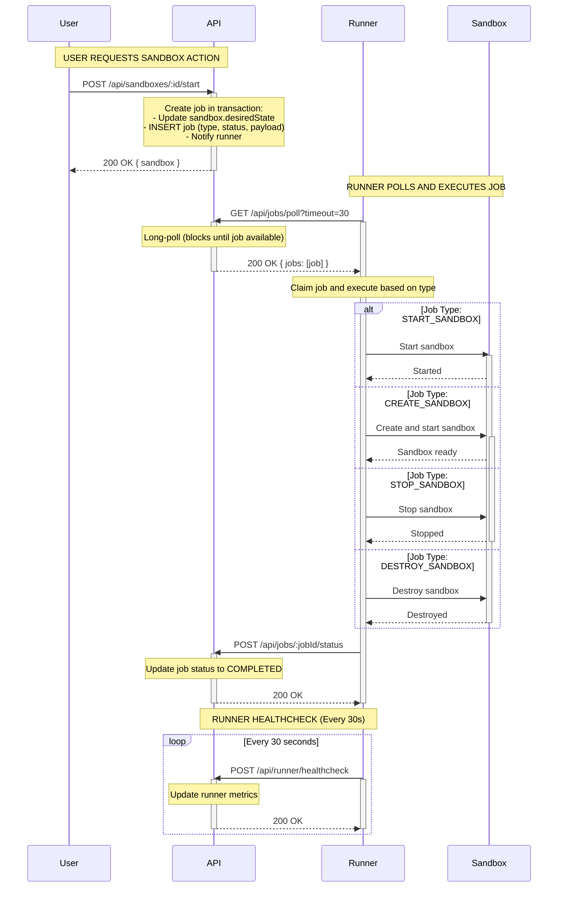

# Runner-Service Job Flow Sequence Diagram

This diagram illustrates the complete flow of sandbox actions from the Daytona API through the job-based runner system (v3).

## Mermaid Sequence Diagram



## Key Flow Points

### 1. Job Creation (Atomic)

- Jobs are created **synchronously** in the same database transaction as the state change
- This ensures atomicity: either both succeed or both fail
- Only happens for v3 runners (version check)

### 2. Long-Polling Mechanism

- Runner makes HTTP GET request with 30s timeout
- API checks database immediately
- If no jobs, API blocks on Redis BRPOP
- When job is created, API pushes notification to Redis
- Long-poll unblocks and returns jobs

### 3. Job Execution

- Runner claims job atomically (UPDATE with WHERE status='PENDING')
- Executes appropriate handler based on job type
- Updates sandbox state via API throughout execution
- Marks job as COMPLETED when done

### 4. V3 vs V0 Separation

- **V3 runners**: Job-based flow (shown above)
- **V0 runners**: Legacy adapter flow (synchronous HTTP calls)
- Reconcilers check runner version and skip v3 entirely

### 5. State Management

- **For v3**: `SandboxJobService.handleJobCompletion()` updates sandbox state
- **For v0**: Reconciler actions update sandbox state
- Clean separation, no mixing of logic

## Job Types

| Job Type | Description | Handler Location |
|----------|-------------|------------------|
| `CREATE_SANDBOX` | Pull image, create container, start daemon | [create_sandbox.go](apps/runner-service/internal/executor/create_sandbox.go) |
| `START_SANDBOX` | Start existing container | [start_sandbox.go](apps/runner-service/internal/executor/start_sandbox.go) |
| `STOP_SANDBOX` | Stop running container (SIGTERM) | [stop_sandbox.go](apps/runner-service/internal/executor/stop_sandbox.go) |
| `DESTROY_SANDBOX` | Force remove container | [destroy_sandbox.go](apps/runner-service/internal/executor/destroy_sandbox.go) |
| `BUILD_SNAPSHOT` | Create snapshot from container | (Not yet implemented) |
| `PULL_SNAPSHOT` | Pull snapshot from registry | (Not yet implemented) |
| `CREATE_BACKUP` | Create backup archive | (Not yet implemented) |

## API Endpoints

### For Runners (Runner Auth Required)

```
GET  /api/jobs/poll?timeout=30&limit=10    - Long-poll for jobs
POST /api/jobs/:jobId/status               - Update job status
POST /api/runner/healthcheck               - Report health metrics
```

### For Users (User Auth Required)

```
POST /api/sandboxes                        - Create sandbox (triggers CREATE_SANDBOX job)
POST /api/sandboxes/:id/start              - Start sandbox (triggers START_SANDBOX job)
POST /api/sandboxes/:id/stop               - Stop sandbox (triggers STOP_SANDBOX job)
DELETE /api/sandboxes/:id                  - Destroy sandbox (triggers DESTROY_SANDBOX job)
```

## Database Schema

### Job Table

```sql
CREATE TABLE job (
  id VARCHAR PRIMARY KEY,
  type VARCHAR NOT NULL,              -- JobType enum
  status VARCHAR NOT NULL,            -- PENDING, IN_PROGRESS, COMPLETED, FAILED
  "resourceType" VARCHAR NOT NULL,    -- SANDBOX, SNAPSHOT, BACKUP
  "resourceId" VARCHAR NOT NULL,      -- sandboxId, snapshotId, etc.
  "runnerId" VARCHAR NOT NULL,
  payload JSONB,
  "errorMessage" TEXT,
  "createdAt" TIMESTAMP DEFAULT NOW(),
  "updatedAt" TIMESTAMP,
  "claimedAt" TIMESTAMP
);

CREATE INDEX idx_job_runner_status ON job("runnerId", status);
```

## Configuration

### Runner-Service Environment Variables

```bash
API_URL=http://localhost:3000        # Daytona API base URL
API_KEY=runner-secret-key            # Runner authentication key
DOCKER_HOST=unix:///var/run/docker.sock
POLL_TIMEOUT=30s                     # Long-poll timeout
POLL_LIMIT=10                        # Max jobs per poll
HEALTHCHECK_INTERVAL=30s             # Healthcheck frequency
LOG_LEVEL=info
```

## Sequence Diagram Formats

This diagram is provided in **Mermaid** format, which is supported by:

- GitHub (renders automatically in README.md)
- GitLab
- Visual Studio Code (with Mermaid extension)
- JetBrains IDEs (with Mermaid plugin)
- Online tools: https://mermaid.live/
- Documentation sites (Docusaurus, MkDocs, etc.)

### Alternative Formats

If you need other formats, you can convert this Mermaid diagram to:

- **PlantUML** - Using mermaid-to-plantuml converters
- **Draw.io** - Import Mermaid directly
- **PNG/SVG** - Using Mermaid CLI or online tools
- **ASCII Art** - Using tools like ditaa

## Testing the Flow

### 1. Setup Test Runner (v3)

```sql
UPDATE runner SET version = '3' WHERE id = 'runner-001';
```

### 2. Start Runner-Service

```bash
cd apps/runner-service
go run cmd/runner-service/main.go
```

### 3. Create/Start Sandbox

```bash
curl -X POST http://localhost:3000/api/sandboxes/:id/start \
  -H "Authorization: Bearer $USER_TOKEN"
```

### 4. Monitor Logs

```bash
# API logs - job creation
[SandboxService] Creating START_SANDBOX job for sandbox-123

# Runner logs - polling
[Poller] Polling for jobs
[Poller] Received 1 jobs

# Runner logs - execution
[Executor] Handling START_SANDBOX job
[StartSandbox] Starting container abc123
[Executor] Job completed successfully

# API logs - job completion
[JobService] Job job-456 status updated to COMPLETED
[SandboxJobService] Handling job completion for START_SANDBOX
```

### 5. Verify State

```sql
-- Check job status
SELECT id, type, status FROM job WHERE "resourceId" = 'sandbox-123';

-- Check sandbox state
SELECT id, state, "desiredState", pending FROM sandbox WHERE id = 'sandbox-123';
```

## Architecture References

- Session Summary: [SESSION_SUMMARY_JOB_RUNNER.md](SESSION_SUMMARY_JOB_RUNNER.md)
- Implementation Summary: [IMPLEMENTATION_SUMMARY.md](IMPLEMENTATION_SUMMARY.md)
- V3 Job Reconciler: [SESSION_SUMMARY_V3_JOB_RECONCILER.md](SESSION_SUMMARY_V3_JOB_RECONCILER.md)
- Last Commit: `7a5d7755 - jobs WIP`
