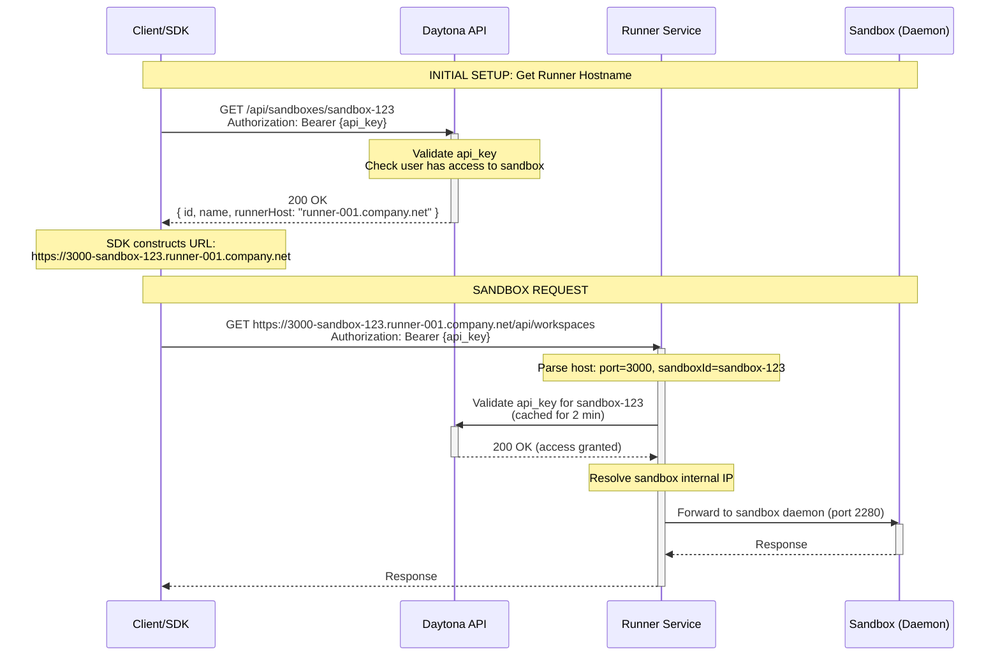

# Sandbox Authentication Flow - Self-Hosted (Direct Runner Access)

This diagram illustrates the sandbox authentication flow for self-hosted deployments where there is no central proxy. The SDK connects directly to the runner-service, with the runner hostname provided by Daytona API.

## Self-Hosted Architecture (SDK → Runner Direct)



## Key Flow Points

### 1. Architecture Overview

**Components:**

- **Client/SDK**: User application making requests
- **Daytona API**: Provides sandbox metadata including runner hostname
- **Runner Service**: Hosts sandboxes and validates API keys (no central proxy)
- **Sandbox Daemon**: Runs on port 2280 inside container

**Key Difference from Public Cloud:**

- No central Daytona Proxy
- SDK connects directly to runner service
- Each runner has its own proxy functionality built-in
- Daytona API only provides runner hostname and validates API keys

### 2. Runner Hostname Resolution

**API Response:**

```json
{
  "id": "sandbox-123",
  "name": "my-sandbox",
  "runnerId": "runner-001",
  "runnerHost": "runner-001.company.net",
  "state": "RUNNING"
}
```

**SDK URL Construction:**

```typescript
const sandbox = await client.sandboxes.get('sandbox-123');
// sandbox.runnerHost = "runner-001.company.net"

const url = `https://${port}-${sandbox.id}.${sandbox.runnerHost}`;
// Result: "https://3000-sandbox-123.runner-001.company.net"
```

### 3. Runner Service Responsibilities

The runner service now handles:

1. **HTTP Proxy Server**
   - Wildcard DNS routing: `*.{runnerHost}`
   - Host parsing: `{port}-{sandboxId}.{runnerHost}`
   - SSL/TLS termination

2. **API Key Validation**
   - Validates against Daytona API
   - Caches validation results (2 min TTL)
   - Returns 401 for invalid keys

3. **Request Forwarding**
   - Resolves sandbox container IP
   - Forwards to sandbox daemon (port 2280)
   - Returns response to client

### 4. URL Format

```
https://{port}-{sandboxId}.{runnerHost}/path

Components:
- port: Target port in sandbox (e.g., 3000, 8080)
- sandboxId: Unique sandbox identifier
- runnerHost: Runner hostname (from Daytona API)
- path: Request path to forward

Example:
https://3000-sandbox-abc123.runner-001.company.net/api/workspaces
```

### 5. API Key Validation & Caching

**Runner-Side Validation:**

```go
func (r *Runner) ValidateApiKey(sandboxId, apiKey string) (bool, error) {
    // 1. Check cache first
    cacheKey := fmt.Sprintf("%s:%s", sandboxId, apiKey)
    if cached, exists := r.cache.Get(cacheKey); exists {
        return cached.(bool), nil
    }

    // 2. Cache miss - validate against Daytona API
    resp, err := r.apiClient.Preview.HasSandboxAccess(sandboxId, apiKey)
    if err != nil {
        return false, err
    }

    isValid := resp.StatusCode == 200

    // 3. Cache result with 2-minute TTL
    r.cache.Set(cacheKey, isValid, 2*time.Minute)

    return isValid, nil
}
```

### 6. Request Flow Comparison

| Step | Public Cloud | Self-Hosted (Direct) |
|------|--------------|---------------------|
| **Get Sandbox Info** | SDK → Daytona API | SDK → Daytona API |
| **DNS Resolution** | `*.proxy.daytona.io` → Central Proxy | `*.{runnerHost}` → Runner Service |
| **Auth Validation** | Proxy → Daytona API | Runner → Daytona API |
| **Caching** | In Proxy (2 min TTL) | In Runner (2 min TTL) |
| **Sandbox Access** | Proxy → Runner → Sandbox | Runner → Sandbox (direct) |
| **Network** | Public internet | Private network (typically) |

### 7. Security Considerations

**API Key Validation:**

- Runner validates API key on first request
- Subsequent requests use cached validation (2 min)
- Invalid keys return 401 Unauthorized

**Network Isolation:**

- Runner accessible only within company network
- Daytona API accessible from runner (outbound only)
- No inbound access from Daytona to runner required

**Runner Authentication:**

- No runner-to-runner authentication needed (direct access)
- Only user API key validation required
- Runner trusts Daytona API for validation

## API Endpoints

### Daytona API (Used by SDK)

```
GET  /api/sandboxes/{sandboxId}              - Get sandbox with runner hostname
POST /api/sandboxes                          - Create sandbox (returns runner hostname)
```

### Daytona API (Used by Runner)

```
GET  /api/preview/{sandboxId}/access         - Validate API key has sandbox access
```

### Runner Service (Direct Access from SDK)

```
ANY  /*                                      - Proxy handler (wildcard DNS)
                                              - Parses host: {port}-{sandboxId}.{runnerHost}
                                              - Validates API key
                                              - Forwards to sandbox daemon
```

### Sandbox Daemon (Port 2280)

```
GET  /api/workspaces     - Workspace API
GET  /api/projects       - Project API
POST /api/process/exec   - Execute commands
...                      - All daemon endpoints
```

## Runner Service Configuration

### DNS Configuration

**Wildcard DNS for Runner:**

```
*.runner-001.company.net → runner-001.company.net
*.runner-002.company.net → runner-002.company.net
```

This allows:

- `3000-sandbox-123.runner-001.company.net` → resolves to runner-001
- `8080-sandbox-456.runner-002.company.net` → resolves to runner-002

### Runner Service Config

```yaml
# Runner service configuration
runner:
  id: runner-001
  hostname: runner-001.company.net
  proxy:
    enabled: true        # Enable built-in proxy functionality
    port: 443
    protocol: https
    tls:
      cert: /etc/certs/runner-001.crt
      key: /etc/certs/runner-001.key

daytona_api:
  url: https://api.daytona.io
  api_key: ${RUNNER_API_KEY}  # For healthcheck and job polling

cache:
  type: memory  # Or Redis if multiple runner instances
  api_key_ttl: 120  # 2 minutes
```

### Environment Variables

```bash
RUNNER_ID=runner-001
RUNNER_HOSTNAME=runner-001.company.net
DAYTONA_API_URL=https://api.daytona.io
RUNNER_API_KEY=runner_key_xyz789
PROXY_ENABLED=true
PROXY_PORT=443
TLS_CERT_FILE=/etc/certs/runner-001.crt
TLS_KEY_FILE=/etc/certs/runner-001.key
```

## SDK Implementation

### Fetching Sandbox with Runner Info

```typescript
// SDK automatically resolves runner hostname
class SandboxClient {
  async get(sandboxId: string): Promise<Sandbox> {
    const response = await this.api.get(`/sandboxes/${sandboxId}`, {
      headers: { 'Authorization': `Bearer ${this.apiKey}` }
    });

    return {
      id: response.id,
      name: response.name,
      runnerId: response.runnerId,
      runnerHost: response.runnerHost,  // e.g., "runner-001.company.net"
      state: response.state,
      // ... other fields
    };
  }

  buildProxyUrl(sandbox: Sandbox, port: number): string {
    return `https://${port}-${sandbox.id}.${sandbox.runnerHost}`;
  }
}
```

### Making Authenticated Requests

```typescript
// Example: Access workspace API in sandbox
const sandbox = await client.sandboxes.get('sandbox-123');

// Construct URL for port 3000
const url = client.sandboxes.buildProxyUrl(sandbox, 3000);
// Result: "https://3000-sandbox-123.runner-001.company.net"

// Make authenticated request
const response = await fetch(`${url}/api/workspaces`, {
  headers: {
    'Authorization': `Bearer ${userApiKey}`,
    'Content-Type': 'application/json'
  }
});

const workspaces = await response.json();
```

## Host Parsing Logic (Runner Service)

```go
// Parse host header to extract port and sandbox ID
// Format: {port}-{sandboxId}.{runnerHost}
func (r *Runner) parseHost(host string) (port, sandboxId string, err error) {
    // Remove runner hostname suffix
    hostPrefix := strings.TrimSuffix(host, "."+r.config.Hostname)

    // Find first dash to separate port from sandbox ID
    dashIndex := strings.Index(hostPrefix, "-")
    if dashIndex == -1 {
        return "", "", errors.New("invalid host format")
    }

    port = hostPrefix[:dashIndex]           // "3000"
    sandboxId = hostPrefix[dashIndex+1:]    // "sandbox-123"

    return port, sandboxId, nil
}
```

## Caching Strategy

### Cache Keys (Runner Service)

```
# API key validity
runner:auth-cache:{sandboxId}:{apiKey} = true/false (TTL: 2 min)
```

### Cache Implementation

**In-Memory (Single Runner Instance):**

```go
type AuthCache struct {
    mu    sync.RWMutex
    cache map[string]*CacheEntry
}

type CacheEntry struct {
    value     bool
    expiresAt time.Time
}

func (c *AuthCache) Get(key string) (bool, bool) {
    c.mu.RLock()
    defer c.mu.RUnlock()

    entry, exists := c.cache[key]
    if !exists || time.Now().After(entry.expiresAt) {
        return false, false
    }

    return entry.value, true
}
```

**Redis (Multiple Runner Instances):**

```go
func (r *Runner) getCachedAuthStatus(sandboxId, apiKey string) (*bool, error) {
    key := fmt.Sprintf("runner:auth-cache:%s:%s", sandboxId, apiKey)

    val, err := r.redis.Get(ctx, key).Result()
    if err == redis.Nil {
        return nil, nil  // Cache miss
    }
    if err != nil {
        return nil, err
    }

    isValid := val == "true"
    return &isValid, nil
}
```

## Deployment Example

### Docker Compose (Self-Hosted Runner)

```yaml
version: '3.8'

services:
  runner:
    image: daytonaio/runner:latest
    container_name: daytona-runner-001
    environment:
      - RUNNER_ID=runner-001
      - RUNNER_HOSTNAME=runner-001.company.net
      - DAYTONA_API_URL=https://api.daytona.io
      - RUNNER_API_KEY=${RUNNER_API_KEY}
      - PROXY_ENABLED=true
      - PROXY_PORT=443
    ports:
      - "443:443"      # HTTPS proxy
      - "8080:8080"    # Runner API (internal)
    volumes:
      - /var/run/docker.sock:/var/run/docker.sock
      - ./certs:/etc/certs:ro
    networks:
      - daytona

networks:
  daytona:
    driver: bridge
```

### Nginx Reverse Proxy (Optional)

If you need load balancing across multiple runner instances:

```nginx
upstream runner_pool {
    server runner-001:443;
    server runner-002:443;
    server runner-003:443;
}

server {
    listen 443 ssl;
    server_name *.company.net;

    ssl_certificate /etc/certs/wildcard.crt;
    ssl_certificate_key /etc/certs/wildcard.key;

    location / {
        proxy_pass https://runner_pool;
        proxy_set_header Host $host;
        proxy_set_header X-Forwarded-For $proxy_add_x_forwarded_for;
        proxy_set_header X-Forwarded-Proto $scheme;
    }
}
```

## Error Handling

### API Key Validation Failure

```
Request:
GET https://3000-sandbox-123.runner-001.company.net/api/workspaces
Authorization: Bearer invalid_key

Response:
HTTP/1.1 401 Unauthorized
{
  "error": "invalid API key",
  "message": "The provided API key does not have access to this sandbox"
}
```

### Sandbox Not Found

```
Request:
GET https://3000-nonexistent-sandbox.runner-001.company.net/api/workspaces
Authorization: Bearer valid_key

Response:
HTTP/1.1 404 Not Found
{
  "error": "sandbox not found",
  "message": "Container not found for sandbox: nonexistent-sandbox"
}
```

### Daytona API Unreachable

```
# Runner cannot validate API key (cache miss)
# Behavior: Reject request for security

Response:
HTTP/1.1 503 Service Unavailable
{
  "error": "validation unavailable",
  "message": "Cannot validate API key: Daytona API unreachable"
}
```

## Migration from Public Cloud

### Step 1: Update Sandbox Records

```sql
UPDATE sandbox
SET runner_host = 'runner-001.company.net'
WHERE runner_id = 'runner-001';
```

### Step 2: Update DNS

```
# Add wildcard DNS records
*.runner-001.company.net → 192.168.1.10
*.runner-002.company.net → 192.168.1.11
```

### Step 3: SDK Update

```typescript
// SDK automatically detects runner_host field
// No code changes required - backward compatible

const sandbox = await client.sandboxes.get('sandbox-123');

// Old (public cloud): sandbox.runnerHost is undefined
//   SDK uses: https://3000-sandbox-123.proxy.daytona.io

// New (self-hosted): sandbox.runnerHost = "runner-001.company.net"
//   SDK uses: https://3000-sandbox-123.runner-001.company.net
```

## Performance Benefits

**Latency Improvement:**

- Public Cloud: Client → Proxy → Runner → Sandbox (3 hops)
- Self-Hosted: Client → Runner → Sandbox (2 hops)
- Reduction: ~100-200ms (eliminates proxy hop)

**Network Traffic:**

- All traffic stays within company network
- No data leaves private network
- Reduced bandwidth costs

**Caching Benefits:**

- First request: 1 API call to Daytona API
- Subsequent requests (2 min): 0 API calls
- Cache hit rate: ~95% (assuming 30s between requests)

## Architecture References

- Runner Registration: [RUNNER_REGISTRATION_SEQUENCE_DIAGRAM.md](RUNNER_REGISTRATION_SEQUENCE_DIAGRAM.md)
- Public Cloud Sandbox Auth: [SANDBOX_AUTH_SEQUENCE_DIAGRAM.md](SANDBOX_AUTH_SEQUENCE_DIAGRAM.md)
- Job Flow: [RUNNER_SERVICE_SEQUENCE_DIAGRAM.md](RUNNER_SERVICE_SEQUENCE_DIAGRAM.md)
- Runner Proxy Implementation: [apps/runner/pkg/api/controllers/proxy.go](apps/runner/pkg/api/controllers/proxy.go)
