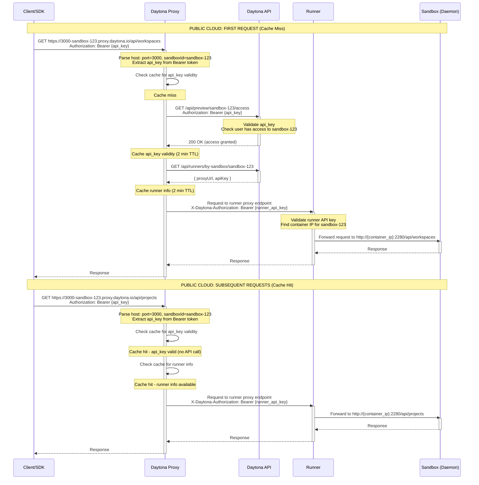
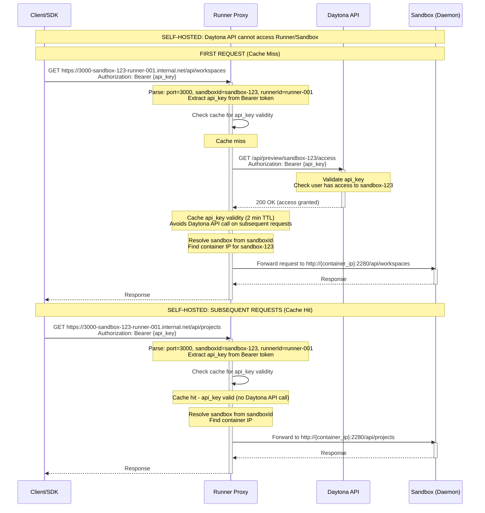

# Sandbox Authentication Flow Sequence Diagram

This diagram illustrates how sandbox access is authenticated in both public cloud and self-hosted scenarios.

## Public Cloud Offering (Daytona-Hosted Proxy)



## Self-Hosted (Runner in Client Network)



## Key Flow Points

### 1. Public Cloud Architecture

**Components:**

- **Daytona Proxy**: Centralized proxy hosted by Daytona (`*.proxy.daytona.io`)
- **Daytona API**: Validates API keys and provides runner routing info
- **Runner**: Hosts sandboxes, proxies requests to sandbox containers
- **Sandbox**: Container running daemon on port 2280

**URL Format:**

```
https://{port}-{sandboxId}.proxy.daytona.io/path
Example: https://3000-sandbox-abc123.proxy.daytona.io/api/workspaces
```

### 2. Self-Hosted Architecture

**Components:**

- **Runner Proxy**: Deployed in client network alongside runner
- **Daytona API**: Only validates API keys (cannot access runner/sandbox)
- **Sandbox**: Container in client network

**URL Format:**

```
https://{port}-{sandboxId}-{runnerId}.internal.net/path
Example: https://3000-sandbox-abc123-runner-001.internal.net/api/workspaces
```

**Key Difference:**

- Runner proxy is in the same network as sandboxes
- Daytona API is only called for API key validation
- All sandbox routing happens locally

### 3. Authentication Methods

The proxy supports multiple authentication methods (in order of precedence):

1. **Bearer Token (API Key or JWT)**

   ```
   Authorization: Bearer {api_key}
   ```

2. **Preview Token Header**

   ```
   X-Daytona-Preview-Token: {preview_token}
   ```

3. **Query Parameter**

   ```
   ?DAYTONA_SANDBOX_AUTH_KEY={preview_token}
   ```

4. **Cookie**

   ```
   Cookie: daytona-sandbox-auth-{sandboxId}={encrypted_value}
   ```

### 4. API Key Validation & Caching

**Validation Logic:**

```typescript
async function validateApiKey(sandboxId: string, apiKey: string): Promise<boolean> {
  // 1. Check cache first
  const cacheKey = `${sandboxId}:${apiKey}`;
  const cached = await cache.get(cacheKey);
  if (cached !== null) {
    return cached; // Return cached validity (avoids API call)
  }

  // 2. Cache miss - validate against Daytona API
  const isValid = await daytonaApi.hasSandboxAccess(sandboxId, apiKey);

  // 3. Cache result with 2-minute TTL
  await cache.set(cacheKey, isValid, 120);

  return isValid;
}
```

**Cache Benefits:**

- Reduces load on Daytona API
- Improves response time (no external API call)
- Works for both public cloud and self-hosted
- 2-minute TTL balances performance vs. security

### 5. Runner Info Resolution (Public Cloud Only)

**Runner Lookup:**

```typescript
async function getRunnerInfo(sandboxId: string): Promise<RunnerInfo> {
  // 1. Check cache
  const cached = await cache.get(`runner:${sandboxId}`);
  if (cached) return cached;

  // 2. Fetch from Daytona API
  const runner = await daytonaApi.getRunnerBySandboxId(sandboxId);
  const info = {
    proxyUrl: runner.proxyUrl,  // e.g., https://runner-001.daytona.io
    apiKey: runner.apiKey        // Runner API key for auth
  };

  // 3. Cache for 2 minutes
  await cache.set(`runner:${sandboxId}`, info, 120);

  return info;
}
```

### 6. Request Flow Comparison

| Step | Public Cloud | Self-Hosted |
|------|--------------|-------------|
| **DNS Resolution** | `*.proxy.daytona.io` → Daytona Proxy | `*.internal.net` → Runner Proxy (local) |
| **Auth Validation** | Proxy → Daytona API | Runner Proxy → Daytona API |
| **Caching** | Yes (2 min TTL) | Yes (2 min TTL) |
| **Runner Routing** | Proxy → Daytona API → Runner | Not needed (proxy on runner) |
| **Sandbox Access** | Proxy → Runner → Sandbox | Runner Proxy → Sandbox (local) |

### 7. Security Considerations

**API Key Validation:**

- Every first request validates against Daytona API
- Subsequent requests use cached validation (2 min)
- Invalid keys return 401 Unauthorized

**Runner Authentication (Public Cloud):**

- Proxy authenticates to runner with `X-Daytona-Authorization` header
- Uses runner-specific API key (different from user API key)
- Prevents unauthorized runner access

**Network Isolation (Self-Hosted):**

- Daytona API never accesses client network
- Runner proxy handles all local routing
- Only API key validation requires external call

## API Endpoints

### Daytona API (Used by Proxy)

```
GET  /api/preview/{sandboxId}/access        - Validate API key has sandbox access
GET  /api/runners/by-sandbox/{sandboxId}    - Get runner info for sandbox (public cloud only)
POST /api/preview/{sandboxId}/token/valid   - Validate preview token (alternative auth)
```

### Runner API (Used by Public Cloud Proxy)

```
ANY  /sandboxes/{sandboxId}/toolbox/{port}/{path}  - Proxy to sandbox daemon
```

### Sandbox Daemon (Port 2280)

```
GET  /api/workspaces     - Workspace API
GET  /api/projects       - Project API
POST /api/process/exec   - Execute commands
...                      - All daemon endpoints
```

## URL Host Parsing

### Public Cloud Format

```go
// Input: "3000-sandbox-abc123.proxy.daytona.io"
func parseHost(host string) (port, sandboxId string, err error) {
  parts := strings.Split(host, ".")
  hostPrefix := parts[0]  // "3000-sandbox-abc123"

  dashIndex := strings.Index(hostPrefix, "-")
  port = hostPrefix[:dashIndex]      // "3000"
  sandboxId = hostPrefix[dashIndex+1:]  // "sandbox-abc123"

  return port, sandboxId, nil
}
```

### Self-Hosted Format

```go
// Input: "3000-sandbox-abc123-runner-001.internal.net"
func parseHost(host string) (port, sandboxId, runnerId string, err error) {
  parts := strings.Split(host, ".")
  hostPrefix := parts[0]  // "3000-sandbox-abc123-runner-001"

  // Split by dashes: ["3000", "sandbox", "abc123", "runner", "001"]
  segments := strings.Split(hostPrefix, "-")

  port = segments[0]  // "3000"

  // Find "runner" keyword to split sandbox ID from runner ID
  runnerIndex := findIndex(segments, "runner")

  sandboxId = strings.Join(segments[1:runnerIndex], "-")  // "sandbox-abc123"
  runnerId = strings.Join(segments[runnerIndex:], "-")     // "runner-001"

  return port, sandboxId, runnerId, nil
}
```

## Configuration Examples

### Public Cloud Proxy Config

```yaml
# Daytona-hosted proxy configuration
proxy:
  domain: proxy.daytona.io
  port: 443
  protocol: https

daytona_api:
  url: https://api.daytona.io
  api_key: ${PROXY_API_KEY}  # Proxy's key to call Daytona API

redis:
  host: redis.daytona.io
  port: 6379
  # Used for caching API key validity and runner info
```

### Self-Hosted Runner Proxy Config

```yaml
# Runner proxy configuration (in client network)
proxy:
  domain: internal.net
  port: 443
  protocol: https

daytona_api:
  url: https://api.daytona.io
  api_key: ${RUNNER_API_KEY}  # Runner's key for API key validation only

runner:
  id: runner-001
  local: true  # Indicates self-hosted mode

cache:
  type: memory  # Or local Redis
  ttl: 120      # 2 minutes
```

## SDK Usage Example

```typescript
// SDK automatically determines the proxy URL based on sandbox metadata

const sandbox = await client.sandboxes.get('sandbox-abc123');

// Public cloud: sandbox.proxyUrl = "https://{port}-sandbox-abc123.proxy.daytona.io"
// Self-hosted: sandbox.proxyUrl = "https://{port}-sandbox-abc123-runner-001.internal.net"

// Make authenticated request to sandbox daemon
const response = await fetch(`${sandbox.proxyUrl.replace('{port}', '3000')}/api/workspaces`, {
  headers: {
    'Authorization': `Bearer ${userApiKey}`
  }
});
```

## Caching Strategy

### Cache Keys

```
# API key validity
proxy:sandbox-auth-key-valid:{sandboxId}:{apiKey} = true/false (TTL: 2 min)

# Runner info (public cloud only)
proxy:sandbox-runner-info:{sandboxId} = { proxyUrl, apiKey } (TTL: 2 min)

# Sandbox public status
proxy:sandbox-public:{sandboxId} = true/false (TTL: 1 hour)
```

### Cache Invalidation

**Automatic:**

- TTL expiration (2 minutes for auth, 1 hour for public status)

**Manual (Future Enhancement):**

- When sandbox permissions change → invalidate auth cache
- When runner assignment changes → invalidate runner info cache
- When sandbox is deleted → invalidate all caches

## Performance Benefits

**Without Caching:**

- Every request: 2-3 API calls to Daytona API
- Latency: ~300ms extra per request
- API load: High

**With Caching (2-min TTL):**

- First request: 2-3 API calls
- Subsequent requests: 0 API calls
- Latency: ~10ms (cache lookup only)
- API load: Reduced by ~95% (assuming 30s avg between requests)

## Future Enhancements

1. **Adaptive TTL**
   - Increase TTL for stable API keys (e.g., 10 min)
   - Decrease TTL for recently changed permissions

2. **Cache Warming**
   - Pre-populate cache when sandbox is created
   - Reduces latency on first access

3. **Event-Based Invalidation**
   - Listen to permission change events
   - Immediately invalidate affected cache entries

4. **Distributed Caching**
   - Use Redis for multi-proxy deployments
   - Share cache across proxy instances

## Architecture References

- Runner Registration: [RUNNER_REGISTRATION_SEQUENCE_DIAGRAM.md](RUNNER_REGISTRATION_SEQUENCE_DIAGRAM.md)
- Job Flow: [RUNNER_SERVICE_SEQUENCE_DIAGRAM.md](RUNNER_SERVICE_SEQUENCE_DIAGRAM.md)
- Proxy Implementation: [apps/proxy/pkg/proxy/](apps/proxy/pkg/proxy/)
- Runner Proxy Controller: [apps/runner/pkg/api/controllers/proxy.go](apps/runner/pkg/api/controllers/proxy.go)
